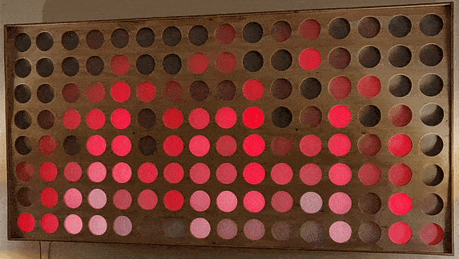

# RGBLedLightBoard_NeoFire

> The visualization after changes (listed below) were made.

## About
This is an Arduino visualization sketch for an RGB LED array comprised of individually addressable WS2812b diodes.  It utilizes the Adafruit NeoMatrix in order to render visuals.  More specifically, this is a sketch that was modified to run on another project, the [rgb-led-light-board](https://github.com/ckuzma/rgb-led-light-board) which is further documented [here](https://github.com/ckuzma/blog/blob/master/posts/2020/2020-03-30-rgb-wall-display-board-part-3.md).

## Changes

- Changed shape of flame. (GIF of the original flame shape can be found [here](old_fire.gif).)
- Slowed down refresh rate to fit desired aesthetic style.
- Removed unnecessary library imports.

## Credit

This project is a lightly-modified fork of the [NeoFire](https://github.com/mic159/NeoFire) project by [@mic159](https://github.com/mic159).
