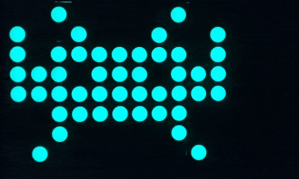

# rgb-led-light-board

> Above is the board in its finished state.

## About

For now, please see [the most recent post on my blog about this project](https://github.com/ckuzma/blog/blob/master/posts/2020/2020-02-09-rgb-wall-display-board-part-2.md) for information about what I am working on and why.

## Visual Routines

### [PrettyColors](Arduino/RGBLedLightBoard_PrettyColors)

### [Text](Arduino/RGBLedLightBoard_Text)

### [USA Bright](Arduino/RGBLedLightBoard_USA_Bright)

### [Space_Invader](Arduino/RGBLedLightBoard_Space_Invader)

>

### [RGBLedLightBoard_NeoFire](https://github.com/ckuzma/RGBLedLightBoard_NeoFire)

> 