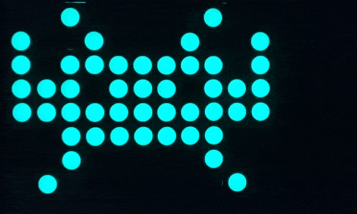
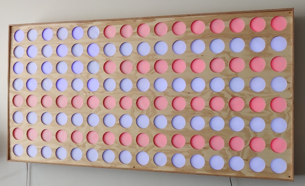
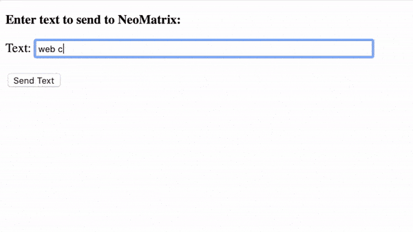

# rgb-led-light-board

> Above is the most recent visualization for the board.

## About

For now, please see [the most recent post on my blog about this project](https://github.com/ckuzma/blog/blob/master/posts/2020/2020-02-09-rgb-wall-display-board-part-2.md) for information about the board.

## Visual Routines

### [NeoFire](https://github.com/ckuzma/NeoFire)

> 

### [Pretty_Colors](Arduino/Pretty_Colors)

>

### [Space_Invader](Arduino/Space_Invader)

>

### [Static_Flag_USA](Arduino/Static_Flag_USA)

>

### [Text_Scrolling_Static](Arduino/Text_Scrolling_Static)

>

### [Text_Scrolling_Webapp](Arduino/Text_Scrolling_Webapp)

>

### [Time_Scrolling](Arduino/Time_Scrolling)

>

